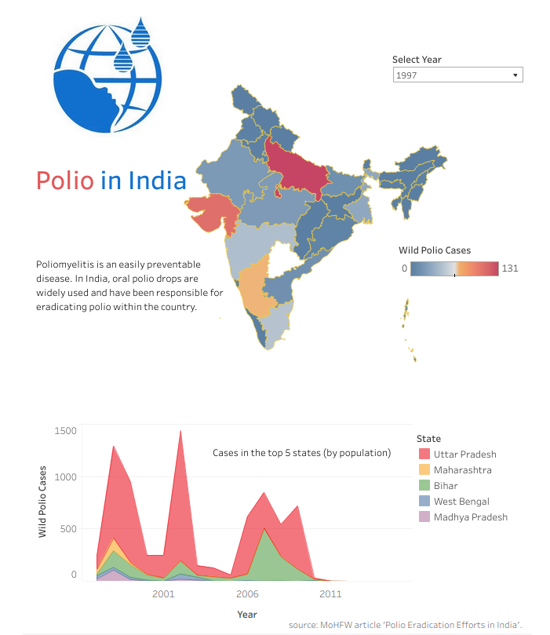

# Polio in India

### Description
- This dashboard visualizes the polio cases across India between 1997 and 2015.
- The data was obtained from the article titled [Polio Eradication Efforts in India](https://main.mohfw.gov.in/sites/default/files/Pulse%20Polio%20Programme.pdf), published by the Ministry of Health & Family Welfare on their website.
- To check out the dashboard [click here](https://public.tableau.com/app/profile/suvarna.rahul/viz/WildPolioCasesinIndia/polio-india-dashboard).
  

### Key Insights
- Polio was a prevalent disease in several states in India.
- States and Union Territories with large populations or high population densities were the most affected by polio.
- A reduction in the number of reported polio cases is seen throughout the available data period.
- No polio cases have been reported in India since 2012.

 ### Limitations
- This data provides insight into a very narrow period (1997 - 2015).
- Some states did not exist until the year 2000; for example, the state of Uttarakhand was formerly a part of Uttar Pradesh.
- Some states did not exist until after 2015, so no data exists for those states separately.
